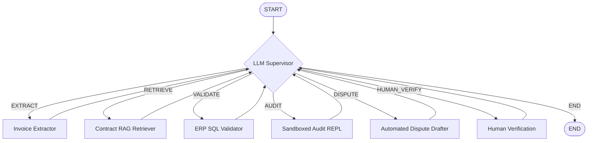

# Multi-Agent Enterprise Invoice Compliance & Audit Engine

An autonomous, stateful, and self-correcting multi-agent compliance engine powered by **LangGraph** and **Llama 3.3 (via Groq)**. The system ingests invoice PDFs, retrieves pricing terms from Master Service Agreements (MSAs), validates quantity thresholds against internal ERP logistics records (SQL), runs deterministic mathematical audits inside a sandboxed Python REPL, and generates automated dispute letters or triggers human reviews.

---

## 🧠 System Architecture

The engine is built on a **directed cyclic graph** topology controlled by an **LLM Supervisor** that coordinates specialized worker agents:



### Specialized Worker Agents:
1. **Invoice Extractor:** Parses unstructured invoice PDFs using local regex/layout parsers or structured LLM calls, validating outputs against a strict **Pydantic schema**.
2. **Contract RAG Retriever:** Performs semantic vector search on Master Service Agreements (MSAs) inside a **Chroma DB** index to identify binding pricing rates, volume discounts, and penalties, passing queries through an **LLM Self-RAG evaluator** to reject irrelevant boilerplate text.
3. **ERP SQL Validator:** Queries relational SQL logistics tables to verify that the hours, units, or volumes billed on the invoice match actual corporate shipping/delivery logs.
4. **Deterministic Audit REPL (Sandbox):** Performs arithmetic auditing exclusively in an isolated Python `exec` environment to prevent LLM calculation hallucinations.
5. **Automated Dispute Drafter:** Generates formal legal billing dispute letters for compliance overcharges under $5,000.
6. **Human Verification (HITL):** Pauses state execution using a checkpoint manager when overcharges exceed $5,000, prompting manual review before resumption.

---

## 🛠️ Advanced Cognitive Behaviors

### 1. Pydantic Self-Correction Loops
If the raw LLM output fails the Pydantic schema validation (e.g. missing dates, malformed IDs), the error traceback is saved to the graph state. The supervisor loops back to the Extractor, providing the validation error context to self-correct the output.

### 2. Python REPL Compiler Debug Loops
The sandboxed mathematical audit executor evaluates generated Python code. If the code throws a syntax or runtime exception (e.g. key error, type error), the system captures the traceback, routes back to the Audit node, and prompts the LLM to analyze the traceback and automatically rewrite the script.

### 3. Human-in-the-Loop (HITL) Interrupts
Using an SQLite checkpointer, the graph serializes its state and triggers an interrupt before entering the human verification node for any invoice discrepancy above $5,000. The execution can be inspected and resumed manually via CLI.

---

## 📂 Datasets

* **Mock MSAs & SOWs:** Pre-defined templates for standard contractors.
* **CUAD Dataset (Contract Understanding Atticus Dataset):** Integrates the industry-standard legal AI benchmark containing real-world SEC-filed commercial agreements for high-scale RAG validation.

---

## 🚀 Getting Started

### 1. Installation
Clone the repository and install the dependencies:
```bash
python -m venv .venv
.venv/Scripts/activate
pip install -r requirements.txt
```

### 2. Configure Environment
Create a `.env` file in the root directory:
```env
GROQ_API_KEY=your_groq_api_key

# LangSmith LLMOps Observability (Optional)
LANGCHAIN_TRACING_V2=true
LANGCHAIN_API_KEY=your_langsmith_api_key
LANGCHAIN_PROJECT=invoice-compliance-engine
```

### 3. Ingest Contracts (Populate Vector DB)
Download the CUAD dataset and build the vector database:
```bash
python src/download_cuad.py
python src/rag_setup.py
```

### 4. Run Compliance Audit
Execute the compliance engine on a target invoice PDF:
```bash
python src/run_audit.py data/invoices/INV-2025-0006.pdf
```

### 5. Resume Paused HITL Audit
If an audit is paused at the human verification step, review the logs and resume the thread:
```bash
python src/human_approve.py thread_INV-2025-0006
```
